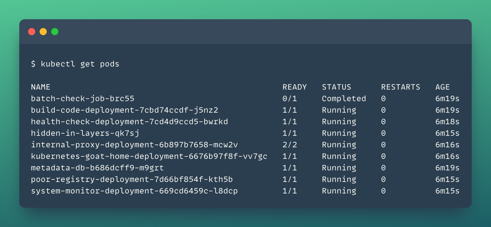

# 👋 Welcome to Kubernetes Goat

[Kubernetes Goat](https://github.com/madhuakula/kubernetes-goat) is an interactive Kubernetes security learning playground. It has intentionally vulnerable by design scenarios to showcase the common misconfigurations, real-world vulnerabilities, and security issues in Kubernetes clusters, containers, and cloud native environments.


It's tough to learn and understand Kubernetes security safely, practically, and efficiently. So here we come to solve this problem not only for security researchers but also to showcase how we can leverage it for attackers, defenders, developers, DevOps teams, and anyone interested in learning Kubernetes security. We are also helping products & vendors to showcase their product or tool's effectiveness by using these playground scenarios and also help them to use this to educate their customers and organizations. This project is a place to share knowledge with the community in well-documented quality content in hands-on scenario approaches.

## 🎯 Goals

Below are some of the main goals of the Kubernetes Goat

* Quick & Easy
* Great Documentation
* Knowledge Sharing
* Scenario-Based Approach
* High-Quality Content
* Interactive Learning
* Real-world Examples
* Practical Hands-On
* Diverse Audiences
* Awesome Community

## 🚨 Disclaimer

Here are some of the disclaimers regarding the Kubernetes Goat you should be aware of before using it.

:::caution

Kubernetes Goat has intentionally created vulnerabilities, applications, and configurations to attack and gain access to your cluster and workloads. Please **DO NOT** run alongside your production environments and infrastructure. So we highly recommend running this in a safe and isolated environment.

:::

:::danger

Kubernetes Goat is used for educational purposes only, do not test or apply these attacks on any systems without permission. Kubernetes Goat comes with absolutely no warranties, by using it you take full responsibility for all the outcomes.

:::

## 🏁 Setup

This section contains a very quick and fastest way to get started. But if you want to use Kubernetes Goat with different environments like GCP GKE, AWS EKS, Fargate, Azure AKS, K3S, etc. **[Refer to the detailed documentation here](how-to-run)**

### 🚀 Free Online Playground

* We have created a simple single-click browser-based online Kubernetes Goat playground using Katacoda. You can try it out right from your browser within seconds for free.

:::tip Free Online Playground

Try it out [https://katacoda.com/madhuakula/scenarios/kubernetes-goat](https://katacoda.com/madhuakula/scenarios/kubernetes-goat)

:::

[](https://katacoda.com/madhuakula/scenarios/kubernetes-goat)


### ✨ Quick Start - Kubernetes

* Ensure you have admin access to the Kubernetes cluster and installed `kubectl`. Refer to the [docs for installation](https://kubernetes.io/docs/tasks/tools/install-kubectl/)
* Ensure you have the `helm` package manager installed. Refer to the [docs for installation](https://helm.sh/docs/intro/install)
* To set up the Kubernetes Goat resources in your cluster, run the following commands

```bash
git clone https://github.com/madhuakula/kubernetes-goat.git
cd kubernetes-goat
bash setup-kubernetes-goat.sh
```

* Ensure the pods are running before running the access script

```bash
kubectl get pods
```



* Access the Kubernetes Goat by exposing the resources to the local system (port-forward) by the following command

```bash
bash access-kubernetes-goat.sh
```

* Then navigate to [`http://127.0.0.1:1234`](http://127.0.0.1:1234)

:::tip

Refer to the detailed documentation [here](how-to-run) if you want to use Kubernetes Goat with different environments like GCP GKE, AWS EKS, Fargate, Azure AKS, K3S, etc. 

:::

## ☸️ Scenarios

**Kubernetes Goat** has more than 20 scenarios covering attacks, defenses, best practices, tools, and others. We are keep updating and working on more and more scenarios, also please feel free to contribute and spread the word 🙌

1. [Sensitive keys in codebases](scenarios/scenario-1.md)
2. [DIND (docker-in-docker) exploitation](scenarios/scenario-2.md)
3. [SSRF in the Kubernetes (K8S) world](scenarios/scenario-3.md)
4. [Container escape to the host system](scenarios/scenario-4.md)
5. [Docker CIS benchmarks analysis](scenarios/scenario-5.md)
6. [Kubernetes CIS benchmarks analysis](scenarios/scenario-6.md)
7. [Attacking private registry](scenarios/scenario-7.md)
8. [NodePort exposed services](scenarios/scenario-8.md)
9. [Helm v2 tiller to PwN the cluster - [Deprecated]](scenarios/scenario-9.md)
10. [Analyzing crypto miner container](scenarios/scenario-10.md)
11. [Kubernetes namespaces bypass](scenarios/scenario-11.md)
12. [Gaining environment information](scenarios/scenario-12.md)
13. [DoS the Memory/CPU resources](scenarios/scenario-13.md)
14. [Hacker container preview](scenarios/scenario-14.md)
15. [Hidden in layers](scenarios/scenario-15.md)
16. [RBAC least privileges misconfiguration](scenarios/scenario-16.md)
17. [KubeAudit - Audit Kubernetes clusters](scenarios/scenario-17.md)
18. [Falco - Runtime security monitoring & detection](scenarios/scenario-18.md)
19. [Popeye - A Kubernetes cluster sanitizer](scenarios/scenario-19.md)
20. [Secure network boundaries using NSP](scenarios/scenario-20.md)

## 🔥 Audience

**Kubernetes Goat** is intended for a variety of audiences and end-users. Which includes hackers, attackers, defenders, developers, architects, DevOps teams, engineers, researchers, products, vendors, and anyone interested in learning about Kubernetes Security. Below are some of the very high-level categories of audience and how this project helps them.


### 💥 Attackers & Red Teams

:::danger Attackers & Red Teams

Learn to attack or find security issues, misconfigurations, and real-world hacks within containers, Kubernetes, and cloud native environments. Enumerate, exploit and gain access to the workloads right from your browser.

:::

### 🛡️ Defenders & Blue Teams

:::caution Defenders & Blue Teams

Understand how attackers think, work and exploit security issues, and apply these learnings to detect and defend them. Also, learn best practices, defenses, and tools to mitigate, and detect in the real world.

:::

### 🔐 Developers & DevOps Teams

:::info Developers & DevOps Teams

Learn the hacks, defenses, and tools. So that you can think like an attacker, and secure your Kubernetes, cloud, and container workloads right from the design, code, and architecture itself to prevent them.

:::

### 🧰 Products & Vendors

:::note Products & Vendors

Use Kubernetes Goat to showcase the effectiveness of the tools, product, and solution. Also, educate the customers and share your product or tool knowledge in an interactive hands-on way.

:::

### 💡 Interested in Kubernetes Security

:::tip Interested in Kubernetes Security

Check out the awesome Kubernetes security resources like popular misconfigurations, hacks, defenses, and tools to gain real-world knowledge. Provide your valuable feedback and suggestions.

:::
