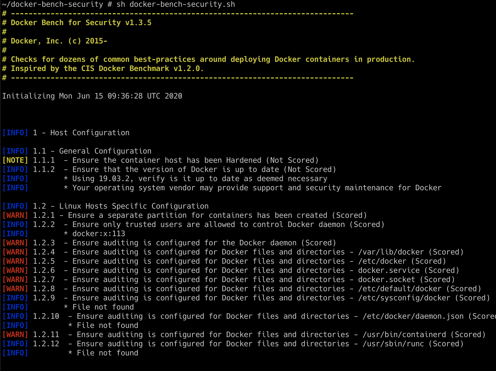

# ⎈ Docker CIS benchmarks analysis

## 🙌 Overview

This scenario is very useful in performing container security audits and assessments. Here we will learn to run the popular CIS benchmark audit for the docker containers and use the results for the further exploitation or fixing of the misconfigurations and vulnerabilities. This is very important and mandates if you are coming from an audit and compliance background in the modern world of containers and cloud native ecosystems.


By the end of the scenario, we will understand and learn the following

1. You will learn to perform CIS benchmark audit for Docker containers
2. Working with Dameonset, Pods in Kubernetes, and other resources in the cluster
3. Gain visibility of the entire Container security posture and understand the risks

### ⚡️ The story

This scenario is mainly to perform the Docker CIS benchmarks analysis on top of Kubernetes nodes to identify the possible security vulnerabilities.

* To get started with this scenario you can either access the node and perform by following docker bench security or run the following command to deploy docker bench security as a [DaemonSet](https://kubernetes.io/docs/concepts/workloads/controllers/daemonset/) in the Kubernetes cluster

:::info

* To get started with the scenario, you can deploy the Docker CIS benchmarks DaemonSet using the following command

```bash
kubectl apply -f scenarios/docker-bench-security/deployment.yaml
```

* To exec into the pod, we can run the following command. Make sure to replace the pod name

```bash
kubectl exec -it docker-bench-security-xxxxx -- sh
```

:::


### 🎯 Goal


:::tip

The goal of this scenario is to perform the Docker CIS benchmark audit and obtain the results from the audit.

:::

### 🪄 Hints & Spoilers

<details>
  <summary><b>✨ Not sure how to run the audit? </b></summary>
  <div>
    <div>Refer to <b>docker-bench-security</b> directory inside the container. Also docs can be found here <a href="https://github.com/docker/docker-bench-security">https://github.com/docker/docker-bench-security</a> 🙌</div>
  </div>
</details>

## 🎉 Solution & Walkthrough

### 🎲 Method 1

* We can deploy the Docker CIS benchmarks by running the following command

```bash
kubectl apply -f scenarios/docker-bench-security/deployment.yaml
```

* Then we can list the running pods from the DaemonSet by running the following command

```bash
kubectl get pods
```


* Now we can see pods are running with `docker-bench-security-xxxxx` and we can use one of the pods and exec into it for performing the audit

* Access the `docker-bench-security-xxxxx` pod by running the following command

```bash
kubectl exec -it docker-bench-security-xxxxx -- sh
```

* The docker-bench-security is already installed inside the container and you can navigate to the respective directory for performing the scan

```bash
cd docker-bench-security
```

* We can run the following command to start the Docker CIS benchmarks script for audit

```bash
sh docker-bench-security.sh
```



* Now based on the vulnerabilities you see from the Docker CIS benchmarks, you can proceed with further exploitation

* Hooray 🥳 , now we can see that it returns the all security issues/misconfigurations from the system


## 🔖 References

* [Docker Bench for Security](https://github.com/docker/docker-bench-security)
* [CIS Benchmarks for Docker](https://www.cisecurity.org/benchmark/docker)
